# 민주화 이후 한국 국회의원 재보궐 선거 데이터 코드북
## Coodbook for General Re/By-Election of South Korea
### Sanghoon Park^[Department of Political Science, University of South Carolina, Columbia, 29208, 817 Henderson Street, Columbia, S.C., United States; [pherephobia@gmail.com](pherephobia@gmail.com)]
### "2022-8-23"
### 1989년 4월 14일부터 2022년 6월 1일까지의 재보궐 146개 선거가 분석대상이며, 이에 대한 자료는 중앙선거관리위원회의 홈페이지의 선거통계시스템(http://info.nec.go.kr)과 중앙선거관리위원회가 편찬한 '대한민국선거사'를 통해 획득하였다. 

# Data Descriptions
## 재보궐 선거 변수

**ELEC_DATE**: 선거일(DATE), 재보궐선거가 실시된 연-월-일 (1989년 민주화 이후의 시점(1989-04-14)부터 현재(2022-8-23)까지 최신화).

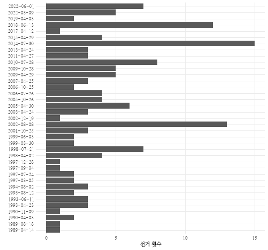

ELEC_TYPE: 선거유형(CHR), 선출유형에 따른 분류 (현재는 국회의원만 코딩).

CITY: 시도(CHR), 시도 구분.

DISTRICT: 선거구(CHR), 선거구명.

ELEC_POP: 선거인수(NUM), 총 유권자 수.

ELEC_VOTER: 투표수(NUM), 총 투표인 수.

ELEC_RESIGN: 기권자수(NUM) 총 유권자 수 - 총 투표인 수.

ELEC_TURNOUT: 투표율(NUM) 총 투표인 수 / 총 유권자 수 * 100.

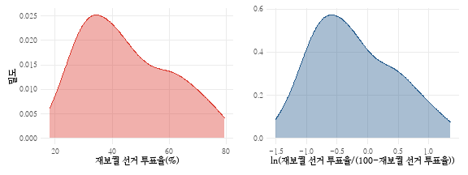

ELEC_REASON: 사유(FCT) 재보궐 시행 사유.

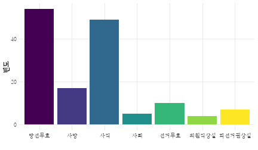

ELEC_REASON_RE: 재보궐 시행 사유 (재코딩, FCT). 1: 일신상의 이유로 사직/사퇴, 2: 비위를 저질렀으나 스스로 사직/사퇴, 3: 비위로 인하여 사법적으로 당선무효/선거무효 처리

구분    | **일신상의 이유로 사직/사퇴**  | **비위로 인한 자진 사직/사퇴** | **비위로 인해 사법적 당선무효/선거무효**    
------------|------------------------------|------------------------------|----------------------------------------
 **당선무효**   | 0         | 2          | 52            
 **사망**     | 17        | 0          | 0             
 **사직**     | 42        | 6          | 1             
 **사퇴**     | 0         | 5          | 0             
 **선거무효**   | 0         | 0          | 10            
 **의원직상실**  | 0         | 0          | 4             
 **피선거권상실** | 0         | 0          | 7             

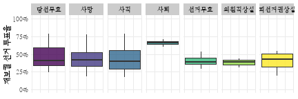

ELEC_COMPETE: 재보궐경쟁률(NUM), 100 * (2위 득표자 득표율 / 해당 재보궐 선거에서 당선자 득표율).

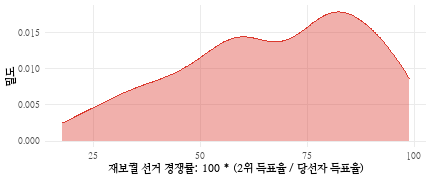

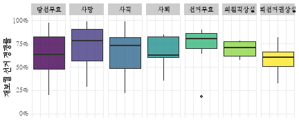

ELEC_COMPETE1: 재보궐경쟁률(NUM), 1위 당선자 득표율 - 2위 후보자 득표율 (윤종빈 2006; 엄기홍 2012).

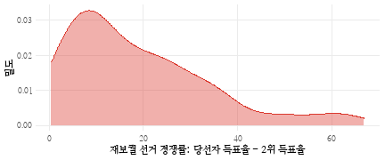

ELEC_COMPETE2: 재보궐경쟁률(NUM), (1위 당선자 득표율 - 2위 후보 득표율)/(1위 당선자 득표율 + 2위 후보 득표율) (김지윤 2010).

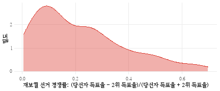

ELEC_COMPETE3: 재보궐경쟁률(NUM), 1 - ((1위 당선자 득표수 - 2위 후보자 득표수)/(1위 당선자 득표수 + 2위 후보자 득표수)) (황아란 2011).

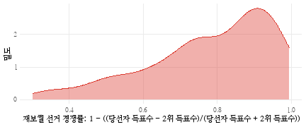

구분  | **선거경쟁도** | **선거경쟁도1** | **선거경쟁도2** | **선거경쟁도3** 
------------|-----------|------------|------------|------------
 **선거경쟁도**  | 1.00      | -0.96      | -0.99      | 0.99       
 **선거경쟁도1** | -0.96     | 1.00       | 0.98       | -0.98      
 **선거경쟁도2** | -0.99     | 0.98       | 1.00       | -1.00      
 **선거경쟁도3** | 0.99      | -0.98      | -1.00      | 1.00       

ELEC_CANDINUM: 재보궐후보자수(NUM), 해당 재보궐 선거에 참여한 후보의 수.

ELEC_EFFECTNUM: 재보궐 유효후보자수(NUM), 해당 재보궐 선거에 참여한 득표율 3% 이상의 유효후보의 수.

## 재보궐 당선자 변수

ELEC_PARTY: 당선자당적(CHR) 재보궐선거 당선자의 당적.

ELEC_ELECTED: 당선자명(CHR), 재보궐선거 당선자의 이름.

ELEC_GENDER: 당선자 성별(CHR), 재보궐선거 당선자의 성별 (남/여).

ELEC_SHARE: 당선자득표율(NUM), 재보궐 선거 당선자의 득표율.

ELEC_NUMBER: 선수(NUM), 재보궐 선거 당선자의 당선 당시 선수 (초선/재선/3선 등).

## 재보궐 2위득표자 변수

RIVAL_PARTY: 2위득표자당적(CHR), 재보궐 선거 2위 득표자의 당적.

RIVAL_NAME: 2위득표자명(CHR), 재보궐 선거 2위 득표자의 이름.

RIVAL_GENDER: 2위득표자성별(CHR), 재보궐선거 2위 득표자의 성별 (남/여).

RIVAL_SHARE: 2위득표자득표율(NUM), 재보궐 선거 2위 득표자의 득표율.

## 재보궐 선거 직전 총선 변수

PRE_POP: 직전총선선거인수(NUM), 해당 재보궐 선거 직전의 총선을 대상으로 선거통계시스템에서 인용한 총 선거인 수.

PRE_VOTER: 직전총선투표인수(NUM), 해당 재보궐 선거 직전의 총선을 대상으로 선거통계시스템에서 인용한 총 투표인 수.

PRE_RESIGN: 직전총선기권자수(NUM), 해당 재보궐 선거 직전의 총선을 대상으로 계산한 기권자 수: 선거인 수 - 총 투표인 수.

PRE_TURNOUT: 직전총선투표율(NUM), 해당 재보궐 선거 직전의 총선을 대상으로 계산한 투표율: 총 투표인 수 / 총 유권자 수 * 100, 소수점 둘째자리로 반올림.

PRE_PARTY: 직전당선자당적(CHR), 해당 재보궐 선거 직전에 당선자의 당적.

PRE_ELECTED: 직전당선자(CHR), 해당 재보궐 선거 직전에 당선된 자의 이름.

PRE_SHARE: 직전총선당선득표율(NUM), 해당 재보궐 선거 직전의 총선에서 당선자의 득표율.

PRE_RIVAL_SHARE: 직전총선2위득표율(NUM), 해당 재보궐 선거 직전의 총선에서 2위 득표자의 득표율.

PRE_COMPETE: 직전선거경쟁률(NUM), 100 * (2위 득표자 득표율 / 해당 재보궐 선거 직전의 총선에서 당선자 득표율).

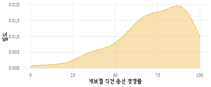

PRE_CANDINUM: 직전선거후보자수(NUM), 해당 재보궐 선거 직전의 총선에 참여한 후보의 수.

PRE_EFFECTNUM: 직전선거 유효후보자수(NUM), 해당 재보궐 선거 직전의 총선에 참여한 득표율 3% 이상의 유효후보의 수.

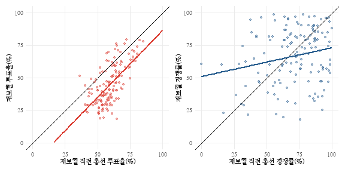

## 재보궐 선거 직후 총선 변수

POST_POP: 직후총선선거인수(NUM), 해당 재보궐 선거 직후의 총선을 대상으로 선거통계시스템에서 인용한 총 선거인 수.

POST_VOTER: 직후총선투표인수(NUM), 해당 재보궐 선거 직후의 총선을 대상으로 선거통계시스템에서 인용한 총 투표인 수.

POST_RESIGN: 직후총선기권자수(NUM), 해당 재보궐 선거 직후의 총선을 대상으로 계산한 기권자 수: 선거인 수 - 총 투표인 수.

POST_TURNOUT: 직후총선투표율(NUM), 해당 재보궐 선거 직후의 총선을 대상으로 계산한 투표율: 총 투표인 수 / 총 유권자 수 * 100, 소수점 둘째자리로 반올림.

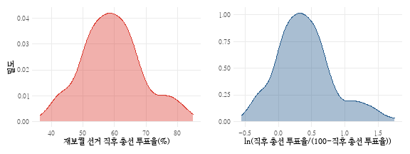

POST_PARTY: 직후당선자당적(CHR), 해당 재보궐 선거 직후의 총선에서 당선자의 당적.

POST_ELECTED: 직후당선자(CHR), 해당 재보궐 선거 직후의 총선에서 당선자의 이름.

POST_SHARE: 직후총선당선득표율(NUM), 해당 재보궐 선거 직후의 총선에서 당선자의 득표율.

POST_RIVAL_SHARE: 직후총선2위득표율(NUM), 해당 재보궐 선거 직후의 총선에서 2위 득표자의 득표율.

POST_COMPETE: 직후총선경쟁률(NUM), 100 * (2위 득표자 득표율 / 해당 재보궐 선거 직후의 총선에서 당선자 득표율).

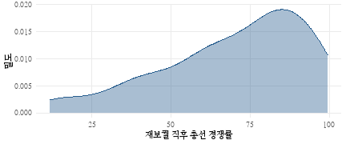

POST_CANDINUM: 직후선거후보자수(NUM), 해당 재보궐 선거 직후의 총선에 참여한 후보의 수.

POST_EFFECTNUM: 직후선거 유효후보자수(NUM), 해당 재보궐 선거 직후의 총선에 참여한 득표율 3% 이상의 유효후보의 수.

## 기타 선거 관련 변수

GENERAL_DATE: 인접총선일자(DATE), 재보궐 선거로부터 가장 가까운 미래 인접 총선의 일자.

GENERAL_DIFF: 인접총선일자차이(NUM), 인접총선일자 - 선거일.

GENERAL_TENURE: 의회임기_남은햇수(NUM), 재보궐 선거 당시 남은 의회 임기(햇수).

PRESIDENT: 역대 대통령

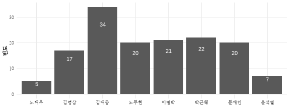

PRESIDENT_DATE: 인접 대선 일자(DATE), 재보궐 선거로부터 가장 가까운 미래 인접 대선의 일자.

PRESIDENT_DIFF: 인접 대선 일자 차이(NUM), 인접대선일자 - 선거일.

PRESIDENT_TENURE: 대통령임기_남은햇수(NUM), 재보궐 선거 당시 남은 대통령 임기(햇수).

LOCAL_DATE: 인접 지선 일자(DATE), 재보궐 선거로부터 가장 가까운 미래 인접 지선의 일자.

LOCAL_DIFF: 인접 지선 일자 차이(NUM), 인접지선일자 - 선거일.

NATL_DATE: 인접 전국단위 선거일자(DATE), 재보궐 선거로부터 가장 가까운 미래 인접 전국단위 선거의 일자.

NATL_DIFF: 인접 전국단위 선거 일자 차이(NUM), 인접 전국단위 선거 일자 - 선거일.

PRESIDENT_POSITIVE: 대통령_평가(긍정)(NUM), 재보궐선거가 실시된 시점 이전의 시기에서 가장 근접한 시점에 조사된 여론조사 전문기관인 한국갤럽이 조사한 주차별 대통령 국정운영 지지율(긍정).

PRESIDENT_NEGATIVE: 대통령_평가(부정)(NUM), 재보궐선거가 실시된 시점 이전의 시기에서 가장 근접한 시점에 조사된 여론조사 전문기관인 한국갤럽이 조사한 주차별 대통령 국정운영 지지율(부정).

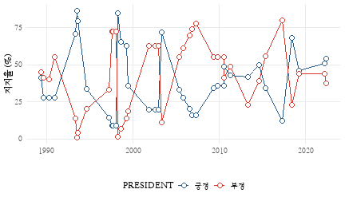

REGIONALISM: 지역주의(FCT), 재보궐 선거가 실시된 지역을 기준으로 지역주의 코딩 (1 = PK (부울경) / 2 = TK (대구경북) / 3 = HN (호남) / 4 = 기타).

RULINGPARTY: 여당(CHR), 재보궐 선거가 실시된 시점의 여당이름.

RULINGAPPROVAL: 여당지지도(NUM), 재보궐 선거가 실시된 시점 이전의 시기에서 가장 근접한 시점에 조사된 여론조사 전문기관인 리서치앤리서치(R&R)가 조사한 여당지지율.

PRE_ELEC_CANDI_DIFF: 직전재보궐후보자수차이(NUM), 재보궐 선거에 참여한 후보자 수 - 해당 재보궐 선거 직전의 총선에 참여한 후보의 수.

POST_ELEC_CANDI_DIFF: 직후재보궐후보자수차이(NUM), 해당 재보궐 선거 직후의 총선에 참여한 후보의 수 - 재보궐 선거에 참여한 후보자 수.

PRE_ELEC_SHIFT: 재보궐전교체(NUM), 재보궐 이전 총선의 당선자로부터 재보궐 선거 당선자의 당적이 교체된 경우 (이항변수; 1, 0).

POST_ELEC_SHIFT: 재보궐이후교체(NUM), 재보궐 선거 당선자로부터 재보궐 이전 총선의 당선자의 당적이 교체된 경우 (이항변수; 1, 0).

PRE_ELEC_COMPETE_DIFF: 직전보궐경쟁률차이(NUM), 재보궐경쟁률 - 직전선거경쟁률.

POST_ELEC_COMPETE_DIFF: 직후보궐경쟁률차이(NUM), 직후선거경쟁률 - 재보궐경쟁률.

PRE_ELEC_SHIFT2: 의석교체(FCT), 여당, 직전당선자당적과 당선자당적 변수를 바탕으로 1 = 여당 $\rightarrow$ 여당 / 2 = 여당 $\rightarrow$ 야당 / 3 = 야당 $\rightarrow$ 여당 / 4 = 야당 $\rightarrow$ 야당.

ELEC_RULING: 여당유리지역주의(FCT), 선거 당시 여당을 지지하는 지역주의에 선거구가 위치하고 있으면 1 아니면 0.

ELEC_OPPOSITION: 야당유리지역주의(FCT), 선거 당시 야당을 지지하는 지역주의에 선거구가 위치하고 있으면 1 아니면 0.

PREVOTE: 사전투표제 도입 여부(NUM), 사전투표제도가 도입된 2013년도 상반기 재·보궐선거 이후 선거일 경우 1, 아니면 0.

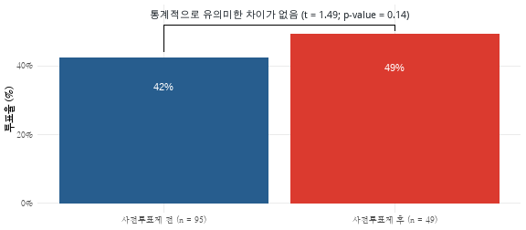

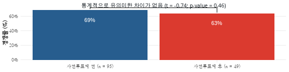

METROPOL: 지역구 도시 규모(FCT), 광역시 및 특별시 = 1 / 중소도시 = 2 / 읍면지역 = 3.

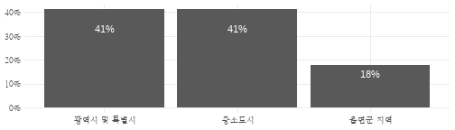

# APPENDIX
## 재보궐 선거 지역구에 대한 간략한 정보

 **재보궐 선거일**    | **시도** | **지역구**      | **재보궐 사유** | **투표율** 
----------------|--------|--------------|------------|---------
 **1989-04-14** | 강원도    | 동해시          | 당선무효       | 79.1    
 **1989-08-18** | 서울시    | 영등포을         | 당선무효       | 69.8    
 **1990-04-03** | 대구시    | 서구갑          | 사퇴         | 63.9    
 **1990-04-03** | 충청북도   | 진천음성군        | 사망         | 78.2    
 **1990-11-09** | 전라남도   | 영광함평군        | 당선무효       | 70.2    
 **1993-04-23** | 부산시    | 동래구갑         | 사직         | 40.4    
 **1993-04-23** | 부산시    | 사하구          | 당선무효       | 42.1    
 **1993-04-23** | 경기도    | 광명시          | 사망         | 41.2    
 **1993-06-11** | 강원도    | 명주양양군        | 사퇴         | 68.5    
 **1993-06-11** | 강원도    | 철원화천군        | 사퇴         | 66.0    
 **1993-06-11** | 경상북도   | 예천군          | 사퇴         | 71.3    
 **1993-08-12** | 대구시    | 동구을          | 사퇴         | 60.2    
 **1993-08-12** | 강원도    | 춘천시          | 사망         | 58.5    
 **1994-08-02** | 대구시    | 수성갑          | 당선무효       | 46.3    
 **1994-08-02** | 강원도    | 영월평창군        | 사망         | 63.1    
 **1994-08-02** | 경상북도   | 경주시          | 사망         | 49.7    
 **1997-03-05** | 인천시    | 서구           | 사망         | 37.3    
 **1997-03-05** | 경기도    | 수원시장안구       | 사망         | 32.7    
 **1997-07-24** | 경상북도   | 포항시북구        | 당선무효       | 63.1    
 **1997-07-24** | 충청남도   | 예산군          | 당선무효       | 68.5    
 **1997-09-04** | 경기도    | 안양시만안구       | 사망         | 33.1    
 **1997-12-28** | 광주시    | 동구           | 사망         | NA      
 **1998-04-02** | 부산시    | 서구           | 당선무효       | 45.7    
 **1998-04-02** | 대구시    | 달성군          | 사직         | 59.4    
 **1998-04-02** | 경상북도   | 문경시예천군       | 당선무효       | 66.3    
 **1998-04-02** | 경상북도   | 의성군          | 당선무효       | 73.9    
 **1998-07-21** | 서울시    | 종로구          | 사직         | 33.7    
 **1998-07-21** | 서울시    | 서초구갑         | 사직         | 37.6    
 **1998-07-21** | 부산시    | 해운대구기장군을     | 사직         | 58.3    
 **1998-07-21** | 대구시    | 북구갑          | 사직         | 39.8    
 **1998-07-21** | 경기도    | 수원시팔달구       | 사망         | 26.2    
 **1998-07-21** | 경기도    | 광명시을         | 사직         | 50.8    
 **1998-07-21** | 강원도    | 강릉시을         | 당선무효       | 54.6    
 **1999-03-30** | 서울시    | 구로구을         | 당선무효       | 40.8    
 **1999-03-30** | 경기도    | 시흥시          | 사망         | 32.2    
 **1999-06-03** | 서울시    | 송파구갑         | 당선무효       | 46.4    
 **1999-06-03** | 인천시    | 계양구강화군갑      | 당선무효       | 35.2    
 **2001-10-25** | 서울시    | 동대문구을        | 선거무효       | 45.6    
 **2001-10-25** | 서울시    | 구로구을         | 당선무효       | 39.4    
 **2001-10-25** | 강원도    | 강릉시          | 사직         | 41.0    
 **2002-08-08** | 서울시    | 종로구          | 당선무효       | 28.9    
 **2002-08-08** | 서울시    | 금천구          | 당선무효       | 24.3    
 **2002-08-08** | 서울시    | 영등포을         | 사직         | 24.0    
 **2002-08-08** | 부산시    | 부산진갑         | 당선무효       | 29.1    
 **2002-08-08** | 부산시    | 해운대기장갑       | 사망         | 18.8    
 **2002-08-08** | 인천시    | 서구 강화군을      | 당선무효       | 34.0    
 **2002-08-08** | 광주시    | 광주 북구갑       | 사직         | 22.4    
 **2002-08-08** | 경기도    | 광명시          | 사직         | 30.4    
 **2002-08-08** | 경기도    | 하남시          | 당선무효       | 36.3    
 **2002-08-08** | 경기도    | 안성시          | 사망         | 43.5    
 **2002-08-08** | 전라북도   | 군산시          | 사직         | 33.2    
 **2002-08-08** | 경상남도   | 마산합포구        | 당선무효       | 29.6    
 **2002-08-08** | 제주시    | 북제주군         | 당선무효       | 57.6    
 **2002-12-19** | 울산시    | 중구           | 사망         | 68.9    
 **2003-04-24** | 서울시    | 양천구을         | 사직         | 26.4    
 **2003-04-24** | 경기도    | 의정부시         | 사직         | 26.0    
 **2003-04-24** | 경기도    | 고양시덕양구갑      | 당선무효       | 25.6    
 **2005-04-30** | 경기도    | 성남시중원구       | 당선무효       | 29.1    
 **2005-04-30** | 경기도    | 포천시연천군       | 당선무효       | 38.1    
 **2005-04-30** | 충청남도   | 공주시연기군       | 당선무효       | 37.9    
 **2005-04-30** | 충청남도   | 아산시          | 당선무효       | 32.0    
 **2005-04-30** | 경상북도   | 영천시          | 당선무효       | 59.1    
 **2005-04-30** | 경상남도   | 김해시갑         | 당선무효       | 34.2    
 **2005-10-26** | 대구시    | 동구을          | 당선무효       | 46.9    
 **2005-10-26** | 울산시    | 북구           | 당선무효       | 53.2    
 **2005-10-26** | 경기도    | 부천시원미구갑      | 당선무효       | 28.9    
 **2005-10-26** | 경기도    | 광주시          | 당선무효       | 36.7    
 **2006-07-26** | 서울시    | 성북구을         | 당선무효       | 28.9    
 **2006-07-26** | 서울시    | 송파구갑         | 사직         | 18.1    
 **2006-07-26** | 경기도    | 부천시소사구       | 사직         | 22.6    
 **2006-07-26** | 경상남도   | 마산시갑         | 당선무효       | 28.8    
 **2006-10-25** | 인천시    | 남동구을         | 피선거권상실     | 24.7    
 **2006-10-25** | 전라남도   | 해남진도         | 피선거권상실     | 40.5    
 **2007-04-25** | 대전시    | 서구을          | 사망         | 34.6    
 **2007-04-25** | 경기도    | 화성시          | 피선거권상실     | 19.3    
 **2007-04-25** | 전라남도   | 무안신안         | 피선거권상실     | 54.4    
 **2009-04-29** | 인천시    | 부평구을         | 선거무효       | 29.1    
 **2009-04-29** | 울산시    | 북구           | 선거무효       | 46.7    
 **2009-04-29** | 전라북도   | 전주시완산구갑      | 선거무효       | 37.8    
 **2009-04-29** | 전라북도   | 전주시덕진구       | 선거무효       | 38.4    
 **2009-04-29** | 경상북도   | 경주시          | 선거무효       | 53.8    
 **2009-10-28** | 경기도    | 수원시장안구       | 선거무효       | 35.8    
 **2009-10-28** | 경기도    | 안산시상록구을      | 선거무효       | 29.3    
 **2009-10-28** | 강원도    | 강릉시          | 선거무효       | 40.3    
 **2009-10-28** | 충청북도   | 증평진천괴산음성군    | 피선거권상실     | 42.9    
 **2009-10-28** | 경상남도   | 양산시          | 선거무효       | 43.9    
 **2010-07-28** | 서울시    | 은평구을         | 당선무효       | 40.5    
 **2010-07-28** | 인천시    | 계양구을         | 사직         | 23.2    
 **2010-07-28** | 광주시    | 남구           | 사직         | 28.7    
 **2010-07-28** | 강원도    | 원주시          | 사직         | 28.7    
 **2010-07-28** | 강원도    | 태백시영월군평창군정선군 | 사직         | 45.1    
 **2010-07-28** | 강원도    | 철원군화천군양구군인제군 | 사망         | 47.4    
 **2010-07-28** | 충청북도   | 충주시          | 사직         | 43.6    
 **2010-07-28** | 충청남도   | 천안시을         | 사직         | 24.3    
 **2011-04-27** | 경기도    | 성남시분당구을      | 사직         | 49.1    
 **2011-04-27** | 전라남도   | 순천시          | 당선무효       | 41.1    
 **2011-04-27** | 경상남도   | 김해시을         | 당선무효       | 41.5    
 **2013-04-24** | 서울시    | 노원구병         | 의원직상실      | 43.5    
 **2013-04-24** | 부산시    | 영도구          | 당선무효       | 36.0    
 **2013-04-24** | 충청남도   | 부여군청양군       | 당선무효       | 44.2    
 **2014-07-30** | 서울시    | 동작구을         | 사직         | 46.8    
 **2014-07-30** | 부산시    | 해운대구기장군갑     | 사직         | 22.9    
 **2014-07-30** | 광주시    | 광산구을         | 사직         | 22.3    
 **2014-07-30** | 대전시    | 대덕구          | 사직         | 32.7    
 **2014-07-30** | 울산시    | 남구을          | 사직         | 29.1    
 **2014-07-30** | 경기도    | 평택시을         | 당선무효       | 29.8    
 **2014-07-30** | 경기도    | 수원시을         | 당선무효       | 27.2    
 **2014-07-30** | 경기도    | 수원시병         | 사직         | 30.8    
 **2014-07-30** | 경기도    | 수원시정         | 사직         | 31.1    
 **2014-07-30** | 경기도    | 김포시          | 사직         | 35.8    
 **2014-07-30** | 충청남도   | 서산시태안군       | 당선무효       | 33.0    
 **2014-07-30** | 충청북도   | 충주시          | 사직         | 33.1    
 **2014-07-30** | 전라남도   | 담양군함평군영광군장성군 | 사직         | 31.6    
 **2014-07-30** | 전라남도   | 나주시화순군       | 당선무효       | 34.6    
 **2014-07-30** | 전라남도   | 순천시곡성군       | 피선거권상실     | 51.0    
 **2015-04-29** | 서울시    | 관악구을         | 의원직상실      | 36.9    
 **2015-04-29** | 인천시    | 서구강화군을       | 당선무효       | 36.5    
 **2015-04-29** | 광주시    | 서구을          | 의원직상실      | 41.1    
 **2015-04-29** | 경기도    | 성남시중원구       | 의원직상실      | 31.5    
 **2017-04-12** | 경상북도   | 상주시군위군의성군청송군 | 당선무효       | 51.7    
 **2018-06-13** | 서울시    | 노원구병         | 사직         | 61.6    
 **2018-06-13** | 서울시    | 송파구을         | 당선무효       | 62.9    
 **2018-06-13** | 부산시    | 해운대구을        | 사직         | 57.9    
 **2018-06-13** | 인천시    | 남동구갑         | 사직         | 54.5    
 **2018-06-13** | 광주시    | 서구갑          | 당선무효       | 59.1    
 **2018-06-13** | 울산시    | 북구           | 당선무효       | 65.5    
 **2018-06-13** | 충청북도   | 제천시단양군       | 당선무효       | 63.3    
 **2018-06-13** | 충청남도   | 천안시갑         | 당선무효       | 48.6    
 **2018-06-13** | 충청남도   | 천안시병         | 사직         | 55.2    
 **2018-06-13** | 전라남도   | 영암군무안군신안군    | 당선무효       | 71.4    
 **2018-06-13** | 경상북도   | 김천시          | 사직         | 70.0    
 **2018-06-13** | 경상남도   | 김해시을         | 사직         | 61.8    
 **2019-04-03** | 경상남도   | 창원시성산구       | 사망         | 51.2    
 **2019-04-03** | 경상남도   | 통영시고성군       | 피선거권상실     | 51.2    
 **2022-03-09** | 서울시    | 종로구          | 사직         | 76.4    
 **2022-03-09** | 서울시    | 서초구갑         | 사직         | 79.5    
 **2022-03-09** | 대구시    | 중구남구         | 사직         | 76.0    
 **2022-03-09** | 경기도    | 안성시          | 당선무효       | 72.0    
 **2022-03-09** | 충청북도   | 청주시상당구       | 당선무효       | 74.8    
 **2022-06-01** | 대구시    | 수성구을         | 사직         | 45.0    
 **2022-06-01** | 인천시    | 계양을          | 사직         | 60.1    
 **2022-06-01** | 경기도    | 성남시분당구갑      | 사직         | 63.8    
 **2022-06-01** | 강원도    | 원주시갑         | 사직         | 51.1    
 **2022-06-01** | 충청남도   | 보령시서천군       | 사직         | 62.0    
 **2022-06-01** | 경상남도   | 창원시의창구       | 사직         | 51.5    
 **2022-06-01** | 제주시    | 제주을          | 사직         | 55.4    

## 주요 변수의 기술통계

 **변수**                 | **관측치** | **평균**   | **표준편차** | **최소값**  | **최대값**   
------------------------|---------|----------|----------|----------|-----------
 **ELEC\_VOTER**        | 145     | 66644.61 | 24909.55 | 27215.00 | 148606.00 
 **ELEC\_TURNOUT**      | 145     | 44.71    | 15.58    | 18.12    | 79.47     
 **ELEC\_SHARE**        | 145     | 53.20    | 10.05    | 22.39    | 83.46     
 **RIVAL\_SHARE**       | 145     | 34.11    | 8.96     | 12.90    | 49.68     
 **ELEC\_COMPETE**      | 145     | 66.86    | 21.16    | 17.84    | 98.82     
 **ELEC\_GENDER***      | 146     | 1.06     | 0.24     | 1.00     | 2.00      
 **PRE\_RESIGN**        | 146     | 63624.24 | 26608.87 | 10012.00 | 128117.00 
 **PRE\_TURNOUT**       | 146     | 59.37    | 9.68     | 36.52    | 85.06     
 **PRE\_COMPETE**       | 146     | 70.94    | 21.09    | 0.00     | 99.98     
 **ELEC\_EFFECNUM**     | 146     | 3.20     | 1.11     | 1.00     | 6.00      
 **PRE\_VOTER**         | 146     | 87920.03 | 24311.92 | 41017.00 | 157419.00 
 **PRE\_SHARE**         | 146     | 50.05    | 11.52    | 0.00     | 89.90     
 **PRE\_RIVAL\_SHARE**  | 146     | 34.07    | 8.32     | 0.00     | 49.34     
 **PRE\_CANDINUM**      | 146     | 4.47     | 1.80     | 1.00     | 12.00     
 **POST\_VOTER**        | 107     | 89583.64 | 22888.56 | 41044.00 | 145744.00 
 **POST\_TURNOUT**      | 107     | 57.41    | 8.61     | 37.71    | 80.58     
 **POST\_SHARE**        | 107     | 51.91    | 10.52    | 30.27    | 84.43     
 **POST\_RIVAL\_SHARE** | 107     | 34.29    | 9.20     | 9.72     | 48.40     
 **POST\_COMPETE**      | 107     | 69.61    | 22.66    | 11.86    | 99.44     
 **POST\_CANDINUM**     | 105     | 4.35     | 1.65     | 2.00     | 11.00     
 **ELEC\_RULING**       | 146     | 0.16     | 0.37     | 0.00     | 1.00      
 **ELEC\_OPPOSITION**   | 146     | 0.29     | 0.46     | 0.00     | 1.00      

